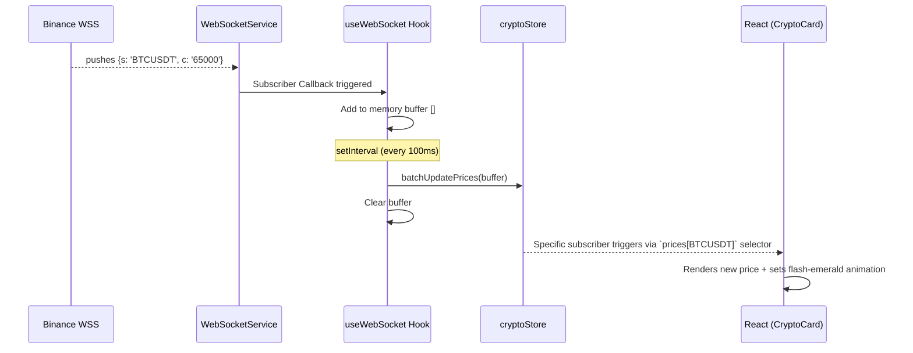

# Architecture Deep Dive

CryptoTrackor uses a heavily decoupled architecture optimized for real-time streaming constraints. Below is a detailed breakdown of the internal systems.

## Component Hierarchy & Modularity

- **Presentational Layer**: `App.tsx` is a stateless facade drawing out the TailwindCSS `grid`. It passes ID strings to its children (e.g., `HistoricalChart` and `CryptoList`).
- **Hook Layer**: `App.tsx` invokes `useWebSocket()` to spin up network streams, and `useCryptoPrices()` to fetch the user selection.
- **Service Layer**: Pure TypeScript classes `WebSocketService.ts` and `CryptoApiService.ts` handle protocols, disconnected from the React lifecycle entirely.

## WebSocket Data Flow

The following sequence diagram outlines how the live Binance pricing data is optimized before reaching the virtual DOM:

## Resilience Systems

1. **Exponential Reconnect WebSockets**: The `attemptReconnect` algorithm uses powers of 2 (1s, 2s, 4s, 8s) to automatically restore connections, resetting after a successful handshake.
2. **Debounced Network Spans**: The `HistoricalChart` doesn't load immediately on click. A 300ms React `setTimeout` inside `useHistoricalData` swallows repetitive clicks spanning different time ranges, saving massive amounts of CoinGecko API bandwidth.
3. **L1/L2 Cache Mapping**: Requests are hashed aggressively (`${cryptoId}-${days}`). By leveraging HTML5 `localStorage` parsed via global singletons, we provide an app-like perceived 0-ms loading screen between sessions.
